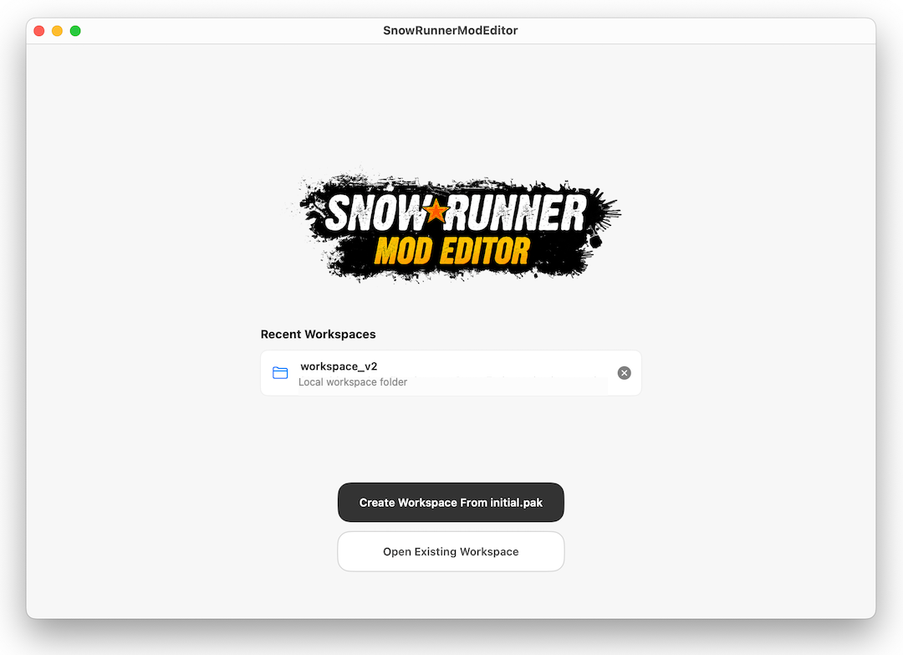
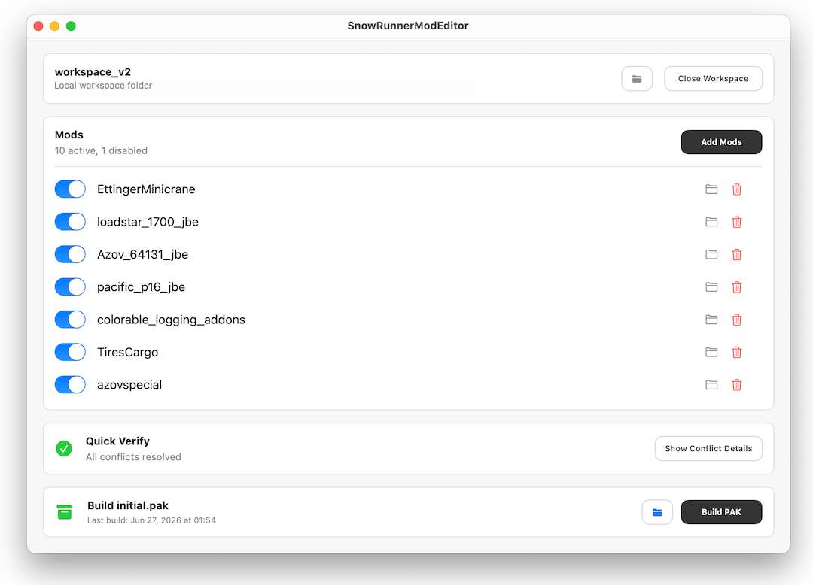

# SnowRunnerModEditor

SnowRunnerModEditor is a native macOS app for building a modded SnowRunner
`initial.pak` from PC mod packages.

The app is designed around a safe workspace workflow. It does not overwrite
your original game files. You choose the game's original `initial.pak`, add mod
PAK files, review the workspace, then build a new output PAK when you are ready.



## What You Need

- A Mac running macOS 15.3 or later.
- A copy of SnowRunner's original `initial.pak`.
- One or more compatible PC SnowRunner mod `.pak` files.
- A backup of any game files you plan to replace manually.

## What The App Does

- Creates an editable workspace from your original `initial.pak`.
- Adds mod PAKs into that workspace.
- Lets you enable, disable, or remove added mods.
- Shows quick mod-to-mod conflict information before you build.
- Builds a verified output PAK for manual installation.
- Writes a build report so you can review what changed.

## Basic Workflow



1. Open SnowRunnerModEditor.
2. Create a workspace from your original `initial.pak`, or open an existing
   SnowRunnerModEditor workspace.
3. Add one or more mod `.pak` files.
4. Enable, disable, or remove mods until the workspace looks right.
5. Review any conflict details shown by the app.
6. Build the output.
7. Back up your game files, then manually copy the generated `initial.pak` into
   the SnowRunner game folder.

The generated files are written inside your workspace:

```text
workspace/build/initial.pak
workspace/build/workspace-build-report.md
```

## Safety Notes

SnowRunnerModEditor never writes directly into your SnowRunner installation.
The original `initial.pak` you used to create the workspace is kept as source
material and is not overwritten.

The app currently focuses on supported PC mod PAK layouts. If a mod uses an
unexpected structure, the build may fail or the report may show conflicts that
need manual review.

## For Advanced Users

This repository also contains lower-level command-line tools for inspecting,
unpacking, rebuilding, and merging SnowRunner PAK files.

CLI documentation lives in:

```text
docs/snowrunner-tool-cli.md
```

Packaging and notarization notes for maintainers live in:

```text
docs/snowrunner-mod-editor-publish.md
```
