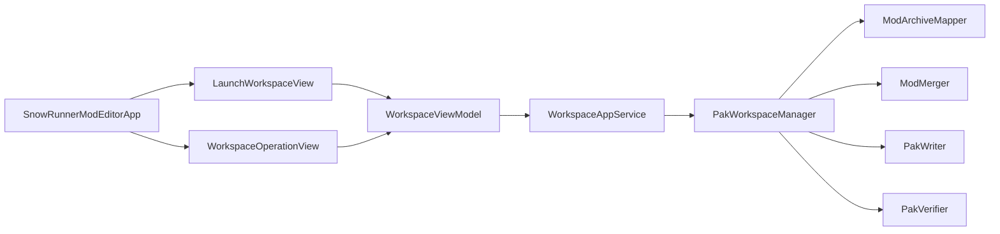

# SnowRunnerModEditor Architecture

## Purpose And Scope

`SnowRunnerModEditor` is the native macOS front end for SnowRunner PAK
workspaces. It does not try to be a general archive browser or an in-app file
editor. Its job is to make the existing workspace workflow visible and safer:

- create a workspace from `initial.pak`,
- open an existing workspace,
- add mod packages,
- enable, disable, and remove mods,
- show quick mod-to-mod target conflicts,
- build the verified output PAK and report.

Manual edits still happen outside the app, usually in Finder or a dedicated
editor, under `initial/` and `mods/`. The app operates the workspace and
delegates all archive semantics to the shared `SnowRunnerCore` library.

## Targets And Boundaries

The package has three relevant production targets:

- `SnowRunnerModEditor`: executable SwiftUI app target. It owns app launch,
  scene composition, SwiftUI views, view-model state, AppKit panel adapters,
  Finder helpers, and the app service adapter.
- `SnowRunnerCore`: shared library target. It owns PAK reading, writing,
  verification, workspace mutation, mod mapping, merge planning, and build
  publishing.
- `SnowRunnerToolCLI`: CLI executable target behind the `snowrunner-tool`
  product. It owns process entry, argument handling, and stdout/stderr
  formatting.

Keep these boundaries sharp. SwiftUI and AppKit code should stay in
`SnowRunnerModEditor`. Workspace and archive semantics should stay in
`SnowRunnerCore`. The app should call library APIs directly, not shell out to
`snowrunner-tool`.

The command-line executable remains a separate adapter over the same library.
This keeps CLI parsing and stdout formatting independent from GUI state.

## Runtime Architecture

The app uses a small unidirectional flow:



`SnowRunnerModEditorApp` owns one `WorkspaceViewModel` for the process. It
switches between `LaunchWorkspaceView` and `WorkspaceOperationView` based on
`WorkspaceViewModel.screen`.

`WorkspaceViewModel` is the state machine for the GUI. Views send user intents
to it. It calls `WorkspaceAppServicing`, updates observable state, and starts
quick verification after workspace mutations.

`WorkspaceAppService` is the bridge from main-actor UI state to blocking
workspace library calls. It returns structured library types, not display-only
strings.

`PakWorkspaceManager` is the headless use-case API. It is the source of truth
for workspace mutation, summary loading, quick verify, full verify, and build.

## State Model

`WorkspaceViewModel` is `@MainActor` and `@Observable`. Maintainers should treat
it as the only mutable app state owner.

Core state:

- `screen`: either `.launch` or `.workspace`.
- `busyState`: one of `.idle`, `.creatingWorkspace`, `.openingWorkspace`,
  `.addingMods`, `.updatingMod`, `.quickVerifying`, or `.building`.
- `summary`: the loaded `PakWorkspaceSummary`, including workspace path, mod
  summaries, and build output paths.
- `quickVerifyResult`: the latest quick verify result for the current
  workspace state.
- `errorMessage`: a user-visible description of the latest blocking error.
- `buildResult`: the latest successful build result.

Important state rules:

- Opening a workspace cancels stale quick verify work and clears prior quick
  verify and build results.
- Failing to open a workspace leaves the app on the launch screen and clears
  workspace state.
- Closing a workspace cancels quick verify, clears summary, errors, build
  result, and returns to the launch screen.
- Adding, enabling, disabling, or removing mods clears `buildResult`, because a
  previous build no longer represents the current workspace.
- Mutations refresh `summary` and then start quick verify.
- `Review Build` is only meaningful after a successful build, so it depends on
  both an open workspace and `buildResult`.

## Workspace Operations

### Create Workspace

`LaunchWorkspaceView` asks the user for an `initial.pak` and an explicit
workspace folder through `AppFilePanels`. The view model calls
`WorkspaceAppService.createWorkspace`, which delegates to
`PakWorkspaceManager.initialize` and then reloads `PakWorkspaceSummary`.

On success, the app enters the workspace screen and starts quick verify. On
failure, the launch screen remains visible and the error message is displayed.

### Open Workspace

Opening a workspace loads `.snowrunner-workspace.json` through
`PakWorkspaceManager.summary`. The selected folder must be a valid workspace.
Invalid folders, unsupported manifest versions, and decode failures are
blocking errors.

### Add Mods

`WorkspaceOperationView` lets the user select one or more mod packages. The
macOS editor accepts direct `.pak` files and downloaded SnowRunner `.zip`
packages. The view model still exposes this as `addMods` because the user task
is adding mods, but the app service calls
`PakWorkspaceManager.addModPackages`.

Package import is intentionally app-facing. Direct `.pak` inputs delegate to
the existing `PakWorkspaceManager.addMods` path, and the CLI continues to use
`addMods` so command-line behavior remains `.pak`-only.

Downloaded `.zip` packages import as one workspace mod. The package importer
opens the outer zip, ignores directory entries, macOS metadata, and zero-byte
inner `.pak` platform placeholders, then materializes each non-empty inner
`.pak` once into temporary files. Non-empty inner `.pak` files must be parseable
SnowRunner zip archives. Loose non-pak files are rejected for now.

Inner pak classification is content-based, not filename-based. This matters
because companion paks can be named `pc.pak`, `nx64.pak`,
`playstation_4.pak`, `playstation_5.pak`, `xbox_series.pak`, or other platform
names. Supported main-source paths are:

- `classes/**`
- `prebuild/meshes/**`
- `ui/textures/**`
- `texts/*.str`

Supported texture-companion paths are:

- `prebuild/textures/**/*.pct`

A package must contain exactly one main candidate. Any number of texture
companions are allowed. Unsupported non-directory entries, multiple main
candidates, unparseable non-zero inner paks, or differing duplicate source
paths reject the whole import before manifest commit. Byte-identical duplicate
source paths are allowed.

The importer extracts all supported entries into one editable
`mods/<mainPakStem>/` directory and writes one synthetic source cache at
`.snowrunner/sources/<mainPakStem>.pak`. The manifest records the original zip
as `sourcePath`, the visible mod/archive name comes from the main inner pak
stem, and build still emits everything into `build/initial.pak`.

After adding mods, the app reloads summary and quick verify runs against the new
enabled mod set.

### Enable And Disable Mods

The manifest field `enabled` controls whether a mod participates in quick
verify, full verify, and build.

Disabling a mod only changes manifest state. It preserves:

- `mods/<folderName>/`,
- `.snowrunner/sources/<folderName>.pak`,
- any manual edits inside the mod folder.

Enabling a mod requires both the editable mod directory and cached source PAK to
exist. This avoids presenting an enabled mod that cannot be mapped or built.

Existing manifests that do not contain `enabled` decode those mods as enabled.
New manifest writes include `enabled`.

### Remove Mods

Removing a mod deletes the editable mod directory, deletes its cached source
PAK, and removes the manifest entry. The implementation uses the manifest's
`sourceCachePath`, not a recomputed default, so manifests with custom-authored
cache paths remove the correct file.

Removal is transactional as far as Foundation file operations allow: moved
files are backed up before the manifest is committed, and rollback restores
them if the commit fails. Backup cleanup after a successful manifest commit is
best effort.

### Quick Verify

Quick verify is a lightweight inspection pass. It answers one question: do two
or more enabled mods map to the same target archive and internal path?

Rules:

- Include only enabled mods.
- Use the same directory-backed mapping code as build.
- Ignore mod-over-initial replacements.
- Flag mod-to-mod duplicates even when bytes are identical.
- Include non-initial archive identity in the displayed target path.
- Do not write a PAK.
- Do not run full output verification.

Quick verify conflicts are not automatically blocking. Build remains available.
If a conflict violates the full merge rules, the build path reports the
blocking error.

The core quick verify result may include byte-identical duplicates because the
merge/report path can still record that overlap. The app model filters those
duplicates out before updating UI state, because build dedupes identical bytes
automatically and users do not need to resolve them.

### Build

Build delegates to `PakWorkspaceManager.build`. The manager creates a temporary
candidate PAK, runs the full workspace merge and output verification path, and
only then publishes:

```text
workspace/build/initial.pak
workspace/build/workspace-build-report.md
```

The original source `initial.pak` is never overwritten.

Build publishing preserves prior output on failure. Before publishing, existing
build artifacts are moved to transaction backups. If either the PAK or report
publish fails, any newly published item is removed and the previous PAK/report
is restored. This protects the last good build even when report publication
fails after the new PAK has been moved into place.

## Concurrency And Cancellation

The view model is main-actor isolated because it drives SwiftUI state.
`WorkspaceAppServicing` is also main-actor-facing, which keeps views and tests
simple.

Actual workspace work can be CPU-heavy and file-heavy, so `WorkspaceAppService`
runs library calls inside `Task.detached`. The private `detachedValue` helper
wraps returned values in `UncheckedSendableBox` because several existing
library result types are not modeled as `Sendable`.

Quick verify has explicit stale-result handling:

- `WorkspaceViewModel` stores the current quick verify task.
- Opening or closing a workspace cancels any existing task.
- Starting quick verify cancels the previous quick verify first.
- Completed quick verify work checks `Task.isCancelled` before updating state.

Quick verify starts after successful workspace create/open and after successful
mod mutations. It does not start after failed operations, because failed
operations keep the previous coherent state visible or return the app to launch.

When adding new async operations, keep state transitions on the main actor and
keep blocking library work behind the service boundary.

## Workspace And Build Invariants

These rules are more important than the current UI shape:

- `.snowrunner-workspace.json` is the source of truth for registered mods.
- Missing `enabled` means enabled for backward compatibility.
- Disabled mods remain in their existing folders and caches.
- Enabled mods must have both an editable mod directory and cached source PAK.
- A downloaded mod zip is represented as one manifest mod, not as separate
  platform paks.
- ZIP package import is editor-only; CLI add-mod semantics remain direct
  `.pak` semantics.
- Quick verify and build include only enabled mods.
- Directory-backed mod mapping is per file path so a combined workspace mod can
  contain both main content and texture companion content. Direct `.pak` archive
  mapping still validates the archive as one role.
- Build output is fixed to `build/initial.pak` and
  `build/workspace-build-report.md`.
- Texture load-list sources are redirected into the generated `initial.pak`
  during build; the workspace does not publish a separate mod texture pak.
- The original source `initial.pak` is read-only from the app's perspective.
- `workspace --verify` does not publish build output.
- `workspace --build` publishes output only after verification succeeds.
- Prior build output and report must survive failed builds and failed publish
  transactions.
- Finder reveal helpers are UI convenience only; they must not become part of
  workspace semantics.

## Error Handling

Blocking errors should stop the current operation, leave the app in a coherent
state, and populate `errorMessage`.

Examples:

- selected folder has no manifest,
- manifest version is unsupported,
- manifest cannot decode,
- selected `initial.pak` fails validation,
- destination workspace has incompatible existing contents,
- selected mod PAK is unsupported,
- selected mod ZIP has loose non-pak files,
- selected mod ZIP has no main inner pak or multiple main inner paks,
- selected mod ZIP has unsupported inner-pak paths,
- selected mod ZIP has differing duplicate source paths across inner paks,
- duplicate mod folder name,
- enabling or building with a missing mod directory,
- enabling or building with a missing cached source PAK,
- quick verify mapping failure,
- build failure,
- output verification failure.

Errors should include the relevant path whenever possible. The library already
owns most path-rich error construction, so prefer adding detail there rather
than formatting errors in SwiftUI views.

Non-blocking states should be represented in normal UI state, not as errors.
Disabled mods, an empty mod list, no quick verify conflicts, quick verify
conflicts, and missing build output are all expected states.

## Testing Strategy

Library tests in `SnowRunnerToolTests` cover workspace semantics:

- manifest compatibility and `enabled` encoding,
- add, enable, disable, and remove behavior,
- editor package import for downloaded zip mods,
- package classification, zero-byte platform placeholder handling, duplicate
  source handling, and atomic rejection,
- mixed directory mapping for combined main and texture companion sources,
- quick verify conflict detection,
- disabled-mod filtering,
- build output publishing,
- rollback when build or report publishing fails,
- path-rich failures for missing mod folders and caches.

App core tests in `SnowRunnerModEditorTests` cover view-model behavior with a
fake `WorkspaceAppServicing`:

- valid open enters the workspace screen,
- invalid open stays on the launch screen,
- stale quick verify cannot update state after a failed open,
- adding mod packages refreshes summary and runs quick verify,
- mutations clear previous build results.

The SwiftUI views currently rely on compiler coverage and manual smoke testing.
Manual GUI checks should cover file panels, Finder reveal actions, disabled
button states, conflict sheet presentation, and build review after a successful
build.

## Code Map

- `Sources/SnowRunnerModEditor/SnowRunnerModEditorApp.swift`
  - App entry point and root screen switch.
- `Sources/SnowRunnerModEditor/LaunchWorkspaceView.swift`
  - Launch screen for creating or opening a workspace.
- `Sources/SnowRunnerModEditor/WorkspaceOperationView.swift`
  - Workspace screen for mods, quick verify, and build actions.
- `Sources/SnowRunnerModEditor/WorkspaceViewModel.swift`
  - Main app state machine and async operation coordination.
- `Sources/SnowRunnerModEditor/WorkspaceAppService.swift`
  - Adapter from main-actor app intents to detached workspace library work.
- `Sources/SnowRunnerModEditor/AppFilePanels.swift`
  - AppKit open-panel wrapper.
- `Sources/SnowRunnerModEditor/FinderActions.swift`
  - Finder reveal/open wrapper.
- `Sources/SnowRunnerCore/PakWorkspace/PakWorkspaceManifest.swift`
  - Workspace manifest, paths, JSON encoder/decoder policy.
- `Sources/SnowRunnerCore/PakWorkspace/PakWorkspaceManager.swift`
  - Headless workspace use cases and transaction-sensitive mutations.
- `Sources/SnowRunnerCore/ModMerge/ModArchiveMapper.swift`
  - Mapping from workspace mod sources to target SnowRunner archive paths.
- `Tests/SnowRunnerModEditorTests/WorkspaceViewModelTests.swift`
  - View-model unit tests with a fake service.
- `Tests/SnowRunnerCoreTests/PakWorkspaceTests.swift`
  - Library-level workspace behavior tests.
- `Tests/SnowRunnerCoreTests/ModArchiveMapperTests.swift`
  - Archive and directory mapping behavior tests.

## Extension Guidelines

When adding features, choose the layer by responsibility:

- Add archive, merge, manifest, or workspace rules to `SnowRunnerTool`.
- Add app workflows and state transitions to `WorkspaceViewModel`.
- Add blocking file operations to `WorkspaceAppService`, keeping the public
  service protocol testable.
- Add visual controls to SwiftUI views after the view model exposes the needed
  intent and state.
- Add AppKit escapes to small helper types, not directly throughout views.
- Add tests at the lowest layer that owns the behavior.

Avoid letting SwiftUI views mutate workspace files directly. Avoid adding
display-only strings to library result models. Avoid treating quick verify as a
replacement for full build verification.
