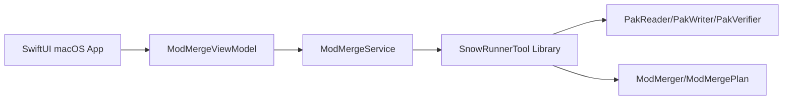

# SnowRunnerTools Mod Merge Mac App Design

## Purpose

Build the first native macOS UI for SnowRunnerTools as a focused Mod Merge
Assistant. The app exists to make the existing `pak merge-mod` workflow easier
and safer without expanding into a general archive workbench.

The first version must never modify the original game `initial.pak`. It writes a
separate candidate PAK that the user can inspect and manually copy after review.

## V1 Scope

In scope:

- A native macOS `.app` bundle launchable from Finder.
- A single-window SwiftUI interface for merging supported mod PAKs into an
  `initial.pak` candidate.
- File selection for:
  - base `initial.pak`
  - one or more mod PAKs
  - candidate output path
- Safe default output naming beside the selected base PAK:
  `initial.merged-YYYYMMDD-HHMM.pak`.
- Dry-run review before writing output.
- Expandable dry-run details for:
  - base entry replacements
  - identical duplicate mapped entries
  - load-list source overrides
  - mod-managed load-list record count
- Explicit `Allow Overwrite` control when mapped mod entries replace existing
  base entries.
- Candidate write plus post-write verification using the existing verifier.
- Clear error states for invalid inputs, unsafe output paths, unsupported mod
  paths, merge failures, and verification failures.

Out of scope for v1:

- Editing or replacing files inside the installed SnowRunner game directory.
- General PAK/cache-block/load-list workbench features.
- Archive browsing or searching every mapped file.
- Installer, signing, notarization, or DMG release polish.
- Progress cancellation unless real merge times make it necessary.

## Product Flow

The app opens directly into the Mod Merge Assistant.

1. User selects the base `initial.pak`.
2. User adds one or more mod PAKs.
3. The app suggests a candidate output path beside the base PAK.
4. User runs `Dry Run`.
5. The app shows a compact summary and expandable evidence lists.
6. If replacements are present, user must explicitly enable `Allow Overwrite`.
7. User clicks `Write Candidate`.
8. The app writes the candidate PAK and verifies it.
9. The app shows the candidate path and verification result.

The app must refuse output paths that equal the base PAK path or any selected
mod PAK path.

## UI Shape

Use a single-window layout:

- Left side: selected files, candidate output path, dry-run/write actions.
- Right side: dry-run summary, expandable detail sections, result/error area.

The right side should make the review state obvious:

- Before dry run: empty or waiting state.
- After successful dry run: summary tiles plus expandable sections.
- When replacements exist: warning state explaining that `Allow Overwrite` is
  required before writing.
- After write: success or failure state with verification details.

The UI should be practical and dense enough for repeated use. Avoid a landing
page or broad feature navigation in v1.

## Architecture

Use an Xcode macOS SwiftUI app target that depends on the existing local
`SnowRunnerTool` Swift package product.

Responsibilities:

- `SnowRunnerTool` library owns archive parsing, mod mapping, load-list overlay,
  PAK writing, report generation, and verification.
- `ModMergeService` adapts library calls into UI operations:
  - dry run
  - write candidate
  - unsafe path validation
  - default output path generation
  - user-facing error mapping
- `ModMergeViewModel` owns selected URLs, output suggestion, busy state, current
  dry-run result, overwrite setting, button enablement, and final write result.
- SwiftUI views render state and collect user input. They should not duplicate
  merge rules or parse CLI output.

The app should call library APIs directly rather than shelling out to the
`snowrunner-tool` executable.

## Core Library Adjustments

The current merge API already returns useful structured data through
`ModMergeResult` and `ModMergePlan`.

V1 can treat unsupported mod paths as blocking errors, matching current CLI
behavior. A later version can add non-blocking skipped-path diagnostics if the
product needs partial mod support.

If UI detail requires original-to-internal mapped file display, add a small
structured field to the core merge result instead of parsing reporter text.

## Error Handling

Blocking errors:

- Missing base PAK.
- No mod PAKs selected.
- Candidate output path equals base PAK or any selected mod PAK.
- Base PAK fails basic verification.
- Base PAK is missing `pak.load_list`.
- Unsupported mod archive path.
- Invalid mod archive.
- Conflicting mapped duplicate with different decompressed bytes.
- Candidate write failure.
- Post-write verification failure.

Review warnings:

- Base entry replacements are present.
- Identical duplicate mapped entries are present.
- Load-list source overrides are present.

Replacements must block `Write Candidate` until `Allow Overwrite` is enabled.

Errors should be displayed as concise user-facing messages with expandable
details when verifier issues or path lists are available.

## Testing

Keep existing library tests as the source of truth for archive correctness.

Add unit tests for the UI-adapter layer:

- default output name generation
- output path refusal when matching inputs
- dry-run success state
- replacement gating without `Allow Overwrite`
- write enabled after explicit overwrite approval
- error mapping for common `ModMergeError` cases

Add view-model tests for state transitions:

- initial empty state
- selecting base PAK updates output suggestion
- adding/removing mods invalidates stale dry-run results
- successful dry run populates review data
- successful write records candidate URL and verification success
- failed write leaves inputs intact and exposes error details

Add a manual `.app` smoke checklist:

- Launch from Finder.
- Select fixture or validation `initial.pak`.
- Add supported mod PAKs.
- Run dry run.
- Confirm expandable sections render.
- Confirm replacements require `Allow Overwrite`.
- Write candidate to suggested path.
- Confirm original base PAK remains unchanged.
- Confirm candidate verification result is shown.

## Packaging Target

V1 should produce a shareable `.app` bundle suitable for local Finder launch.
Do not spend v1 effort on signing, notarization, installers, or DMG packaging.

## Repository Notes

The visual brainstorming companion writes temporary files under `.superpowers/`.
That directory should stay out of commits. If the workflow continues to use the
companion, add `.superpowers/` to `.gitignore` in a separate housekeeping change.
