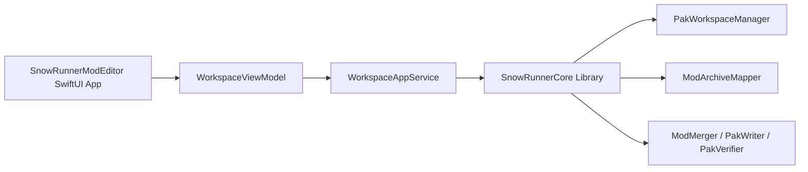

# SnowRunnerModEditor Workspace GUI Design

## Purpose

Build a native macOS SwiftUI app for operating SnowRunner PAK workspaces.

The original need is not an in-app file editor. The app should make the
existing workspace workflow safe and visible:

- create a workspace from `initial.pak`,
- open an existing workspace,
- add, enable, disable, and remove mods,
- surface mod-to-mod file conflicts quickly,
- build the final verified output PAK.

Actual workspace file edits stay in Finder or external editors.

## V1 Scope

In scope:

- A native macOS SwiftUI app named `SnowRunnerModEditor`.
- A two-step interface:
  - launch screen for choosing or creating a workspace,
  - workspace screen for operating that workspace.
- Workspace creation from a selected `initial.pak` and an explicitly selected
  destination folder.
- Workspace opening by selecting a folder that contains a valid
  `snowrunner-workspace.json`.
- Add mod PAKs to the workspace.
- Disable and re-enable mods.
- Remove mods from the workspace.
- Reveal workspace, mod folders, build output, and build report in Finder.
- Quick verify that checks duplicate mapped target files between enabled mods.
- Full build to the fixed workspace output path:
  - `build/initial.pak`
  - `build/workspace-build-report.md`
- Build must run the existing full verification path before publishing output.

Out of scope for V1:

- Editing files inside the app.
- Reordering mods.
- Installing the generated PAK into the game directory.
- Writing build output to arbitrary paths.
- Browsing every archive entry as a general PAK workbench.
- New CLI commands for enabling, disabling, or removing mods.
- Signing, notarization, installer, or DMG polish.

## Product Flow

### Step 1: Launch Screen

The app opens to a workspace-only screen.

Actions:

- `Create Workspace From initial.pak`
  - Select an `initial.pak`.
  - Select an explicit workspace destination folder.
  - Initialize the workspace using the existing workspace manager.
  - Enter the workspace screen on success.
- `Open Existing Workspace Folder`
  - Select a folder.
  - Load `snowrunner-workspace.json`.
  - Fail clearly if the selected folder is not a valid workspace.

No mod, verify, or build controls appear until a workspace is open.

### Step 2: Workspace Screen

The workspace screen is a vertical workflow with this order:

1. Workspace
2. Mods
3. Quick Verify
4. Build Output

The Workspace section shows:

- workspace name,
- workspace path,
- reveal workspace action,
- close workspace action.

The Mods section shows:

- active and disabled mod counts,
- `Add Mods`,
- each mod's name, enabled state, conflict count, and actions.

Per-mod actions:

- reveal mod folder,
- disable active mod,
- enable disabled mod,
- remove mod.

The Quick Verify section shows the current lightweight conflict status.

- If no conflicts exist, show a clean state.
- If conflicts exist, show a `Show Conflict Details` action.
- Conflict details list each duplicated mapped target and the enabled mods that
  map to it.

The Build Output section shows:

- fixed output path `build/initial.pak`,
- fixed report path `build/workspace-build-report.md`,
- `Build PAK`,
- `Review Build`.

`Review Build` reveals the generated output/report after a successful build.

## Workspace Manifest Behavior

Add enabled state to each manifest mod:

```json
{
  "sourcePath": "/mods/demo.pak",
  "folderName": "demo",
  "archiveName": "demo.pak",
  "sourceCachePath": ".snowrunner/sources/demo.pak",
  "enabled": true,
  "entries": []
}
```

Compatibility rule:

- Existing manifest entries without `enabled` decode as enabled.
- New writes include `enabled`.

Disable behavior:

- Set `enabled` to `false`.
- Keep `mods/<name>/`.
- Keep `.snowrunner/sources/<name>.pak`.
- Preserve any manual edits in the unpacked mod folder.

Enable behavior:

- Set `enabled` to `true`.
- Require the mod folder and cached source PAK to still exist.

Remove behavior:

- Delete `mods/<name>/`.
- Delete `.snowrunner/sources/<name>.pak`.
- Remove the mod from `snowrunner-workspace.json`.
- Apply the filesystem changes and manifest update transactionally as far as
  Foundation file APIs allow.

CLI behavior:

- Existing `workspace --verify` and `workspace --build` must include only
  enabled mods.
- No new CLI enable, disable, or remove commands are required for V1.

The manifest remains the single source of truth. Disabled mods are not moved to
another folder.

## Quick Verify

Quick verify answers one question: do any enabled mods map to the same target
path?

Rules:

- Run automatically after:
  - opening a workspace,
  - adding mods,
  - enabling a mod,
  - disabling a mod,
  - removing a mod.
- Use the same directory-backed mod mapping logic as build.
- Include only enabled mods.
- Ignore mod-over-initial replacements.
- Flag any duplicate mapped target between enabled mods.
- Flag duplicates even when bytes are identical.
- Do not write a PAK.
- Do not run the full `workspace --verify` build-and-verify path.
- Cancel stale quick verify work when a newer workspace state supersedes it.

Output model:

```swift
public struct WorkspaceQuickVerifyResult: Equatable {
    public var conflicts: [WorkspaceModConflict]
}

public struct WorkspaceModConflict: Equatable {
    public var targetPath: String
    public var mods: [String]
}
```

If mapping itself fails, quick verify reports a blocking error for the affected
workspace path.

## Build

`Build PAK` runs the full workspace build path. It must:

- use only enabled mods,
- create a temporary candidate,
- run full output verification,
- replace `workspace/build/initial.pak` only after verification passes,
- replace `workspace/build/workspace-build-report.md` only after verification
  passes,
- leave prior build output intact on failure,
- never overwrite the original source `initial.pak`.

Build should remain available even when quick verify reports conflicts, because
quick verify is an inspection aid, not the full build contract. If conflicts are
blocking under existing merge rules, the build fails with the full merge error.

## Architecture

Keep archive and workspace semantics in the `SnowRunnerCore` library. The app
should call library APIs directly instead of shelling out to `snowrunner-tool`.
Those library APIs should be shared headless use-case APIs, not CLI APIs or GUI
APIs. CLI parsing, stdout formatting, SwiftUI state, AppKit panels, and Finder
integration must stay in adapter targets.



Library workspace use-case additions:

- workspace summary loading,
- set mod enabled state,
- remove mod,
- enabled-mod filtering for verify/build,
- quick verify conflict detection,
- build output/report path helpers if needed.

CLI adapter:

- `snowrunner-tool` stays a thin argument adapter,
- converts command-line arguments into library calls,
- converts structured results into stdout/stderr and exit codes,
- owns CLI usage text and command syntax.

App adapter:

- `SnowRunnerModEditorApp`
- `WorkspaceViewModel`
- launch workspace picker view,
- workspace operation view,
- small AppKit helpers for `NSOpenPanel`,
- Finder/review helpers using `NSWorkspace`.

Long operations:

- workspace create,
- add mods,
- quick verify,
- build.

These should run asynchronously. Quick verify should be cancellable so fast
mod-state changes do not show stale conflict results.

## Error Handling

Blocking errors:

- selected workspace folder has no manifest,
- manifest version unsupported,
- manifest cannot decode,
- selected `initial.pak` fails initial validation,
- destination workspace already has incompatible existing contents,
- selected mod PAK is unsupported,
- duplicate mod folder name on add,
- missing mod folder for an enabled mod,
- missing cached source PAK for an enabled mod,
- quick verify mapping failure,
- build failure,
- output verification failure.

User-facing errors should name the path that caused the problem whenever
possible.

Non-blocking states:

- disabled mods are normal,
- quick verify conflicts are shown in the Quick Verify section,
- missing build output disables or explains `Review Build`.

## Testing

Library tests:

- manifest decoding treats missing `enabled` as `true`,
- manifest encoding writes `enabled`,
- disable updates manifest and preserves mod folder/source cache,
- enable updates manifest and requires required files,
- remove deletes mod folder, deletes source cache, and removes manifest entry,
- `workspace --verify` ignores disabled mods,
- `workspace --build` ignores disabled mods,
- quick verify ignores mod-over-initial replacements,
- quick verify flags duplicate mod targets with identical bytes,
- quick verify flags duplicate mod targets with different bytes,
- quick verify reports all involved mod names for each target.

View-model tests:

- launch starts without a workspace,
- invalid workspace open shows an error and stays on launch screen,
- valid workspace open enters workspace screen,
- create workspace enters workspace screen,
- add mods triggers quick verify,
- enable/disable/remove trigger quick verify,
- build success records output and report paths,
- build failure leaves workspace state intact.

Manual app smoke checklist:

- launch app from Finder,
- create a workspace from fixture or runtime `initial.pak`,
- open an existing workspace folder,
- add supported mod PAKs,
- disable and re-enable a mod,
- remove a mod,
- reveal workspace and mod folders,
- verify conflict details display when duplicate mapped targets exist,
- build output,
- review generated PAK/report,
- confirm original `initial.pak` remains unchanged.

## Implementation Notes

The package is SwiftPM-first and exposes `SnowRunnerCore` as the shared
headless library. `SnowRunnerModEditor` is the combined SwiftUI executable
target for app launch, views, and view-model code. If Finder-launch
packaging is awkward through SwiftPM alone, introduce a minimal Xcode project
or generator step that builds the existing app product without moving core code.

Neither adapter should parse the other adapter's output. The GUI should not
parse CLI stdout, and the CLI should not depend on GUI view-model types. Any
detail needed by either adapter should be returned as structured Swift values
from the library.
